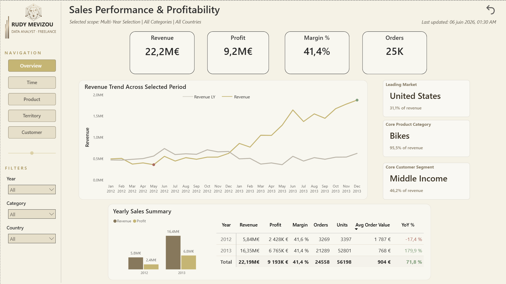
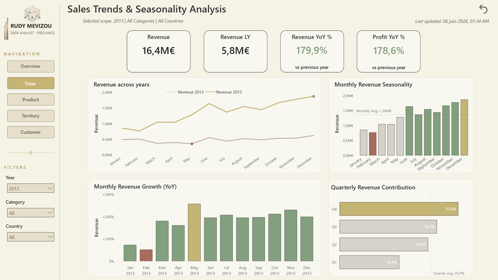
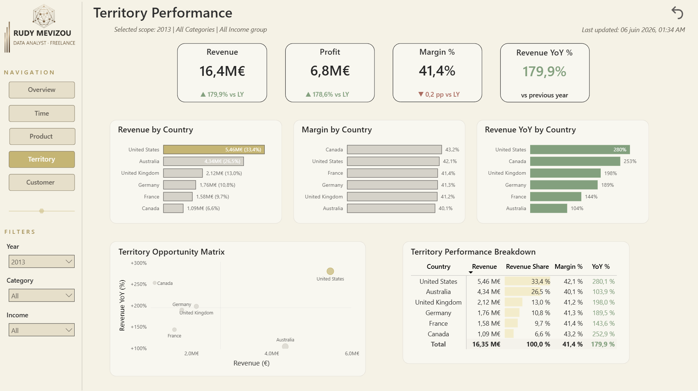

# 🚴 AdventureWorks — Sales Performance & Profitability Analysis

**End-to-end BI project: SQL Server → Power BI → Python/AI reporting.**
An interactive Power BI dashboard and an AI-generated executive report that turn raw sales data into actionable business decisions.

> **Stack:** SQL Server · Power BI · DAX · Power Query (M) · Python (pandas) · AI executive summary
> **Role:** Data preparation, modeling, DAX, dashboard design, automated reporting
> **Data:** Microsoft AdventureWorksDW (internet sales)

---

## Business problem

AdventureWorks, a multinational bike retailer, wants to understand its online sales performance and turn data into decisions:

1. Which products and categories drive revenue and margin?
2. How is revenue evolving over time, and is there seasonality?
3. Where is performance concentrated geographically?
4. Who are the core customers?
5. What are the concrete risks and opportunities?

---

## Key insights (2012–2013)

| KPI | Value |
|---|---|
| Revenue | €22.2M |
| Profit | €9.2M |
| Margin | 41.4% |
| Orders | ~25K |
| Customers | ~18K |

- **Product concentration risk:** Bikes generate **95.5% of revenue** — but **Accessories carry the highest margin (62.6%)** vs 40.8% for bikes. A clear cross-sell opportunity.
- **Trajectory:** revenue nearly **tripled in 2013 (+180%)** after a dip in 2012 — driven by strong year-end months (Nov–Dec).
- **Geographic concentration:** **US + Australia ≈ 60% of revenue**; margins are uniform (~41%) across all countries, so growth — not pricing — is the lever.
- **Customer base:** customers aged **46+ generate ~85% of revenue**; nothing material under 36 — a demographic concentration to watch.

---

## Architecture

```
SQL Server (AdventureWorksDW)
   │  analytical views (bi schema) + 12 data-quality checks
   ▼
Power BI  ──  star schema (Sales fact + Date / Product / Customer / Territory)
   │          130 DAX measures · time intelligence · dynamic titles
   ├─►  Interactive dashboard (5 pages)
   │
   ▼
Python (pandas)  ──  KPI export → AI context builder
   ▼
AI executive report (constat → recommandation)
```

### 1. Data preparation & quality (SQL)
Analytical views in a dedicated `bi` schema, plus a full data-quality suite (12 checks): row counts, NULL checks, key uniqueness, referential integrity, duplicate detection, grain validation, date consistency, business deduplication, value standardization.

### 2. Modeling (Power BI)
Clean **star schema** — a `Sales` fact table surrounded by `Date`, `Product`, `Customer`, `Territory` dimensions. Auto date/time disabled, single-direction relationships, all measures centralized in a dedicated `_Measures` table organized in display folders.

### 3. DAX highlights
- Core KPIs, time intelligence (LY, YoY %), shares & rankings.
- **Comparable-period guard logic** — YoY is only shown when a single, fully comparable year is selected, preventing misleading growth figures on partial years.
- Dynamic titles, dynamic conditional-formatting colors driven by a centralized palette.

### 4. AI reporting (Python)
A Python pipeline exports the model's KPIs and builds a structured context that an LLM turns into an **executive summary with recommendations** — the narrative layer that complements the interactive dashboard.

---

## Dashboard pages

| Page | Question it answers |
|---|---|
| **Overview** | All-time performance & trend at a glance |
| **Trends & Seasonality** | How revenue evolves and when it peaks |
| **Product Performance** | Which products drive revenue vs margin |
| **Territory Performance** | Where performance concentrates |
| **Customer Performance** | Who the core customers are |

> 📸 *Screenshots:*
> 
> 
> 
> 
> 

---

## Repository structure

```
├── 01_SQL/              # Views (bi schema) + data-quality & validation scripts
├── 02_PowerBI/          # .pbix dashboard + custom theme
├── 03_Python/           # AI context builder (KPI export → prompt)
├── 04_Report/           # AI executive summary (PDF)
├── screenshots/         # Dashboard captures
└── README.md
```

---

## How to reproduce
1. Restore the `AdventureWorksDW` database in SQL Server.
2. Run the SQL scripts in `01_SQL/` (views first, then quality checks).
3. Open the `.pbix` in `02_PowerBI/` (update the data source to your server).
4. (Optional) Run the Python pipeline in `03_Python/` to regenerate the AI report.

---

## Author

**Rudy Mevizou** — Freelance Data Analyst (Power BI · SQL · Python)
PhD in Biology · Data Scientist training (DataScientest)

📧 rudy.mevizou.data@outlook.com
🔗 LinkedIn: *[à compléter]* · Malt: *[à compléter]*

---
*Data source: Microsoft AdventureWorksDW sample database. Project built for portfolio purposes.*
