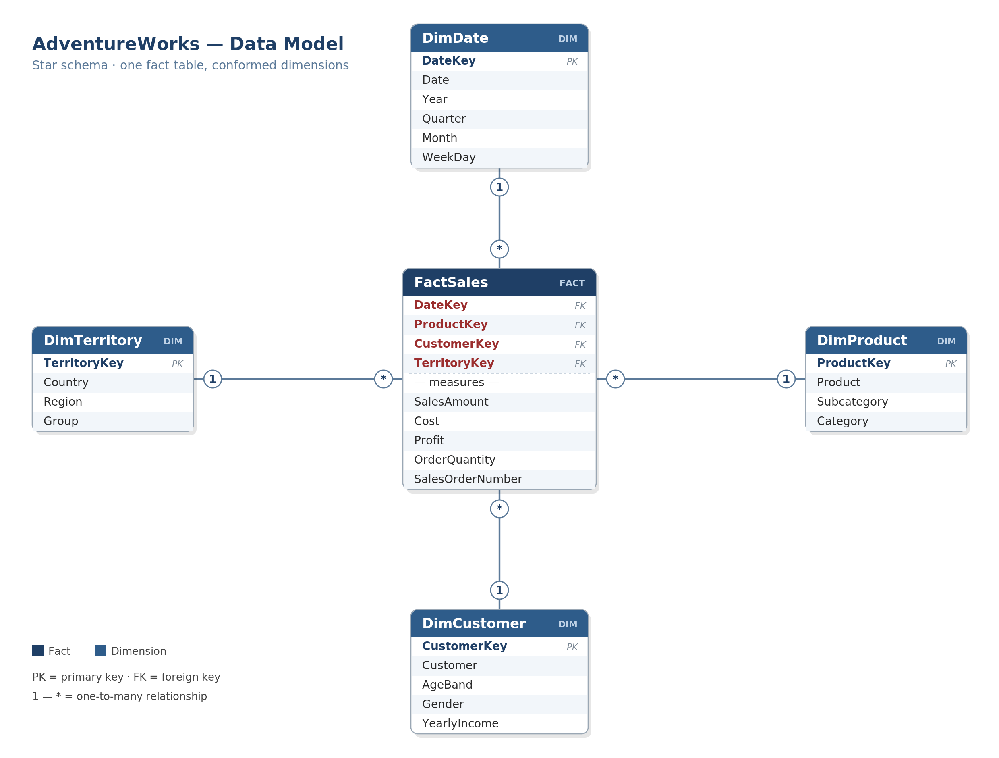
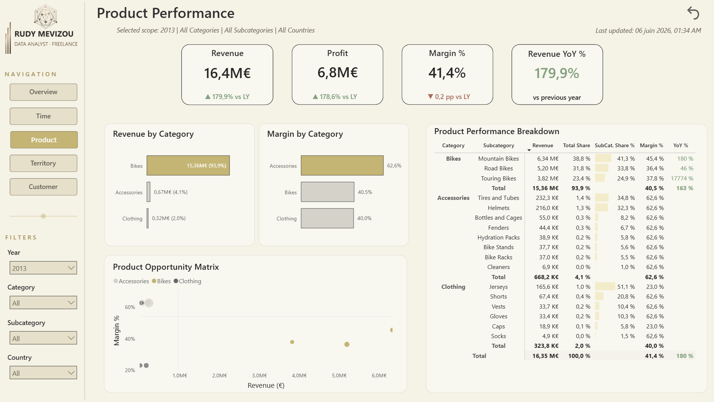
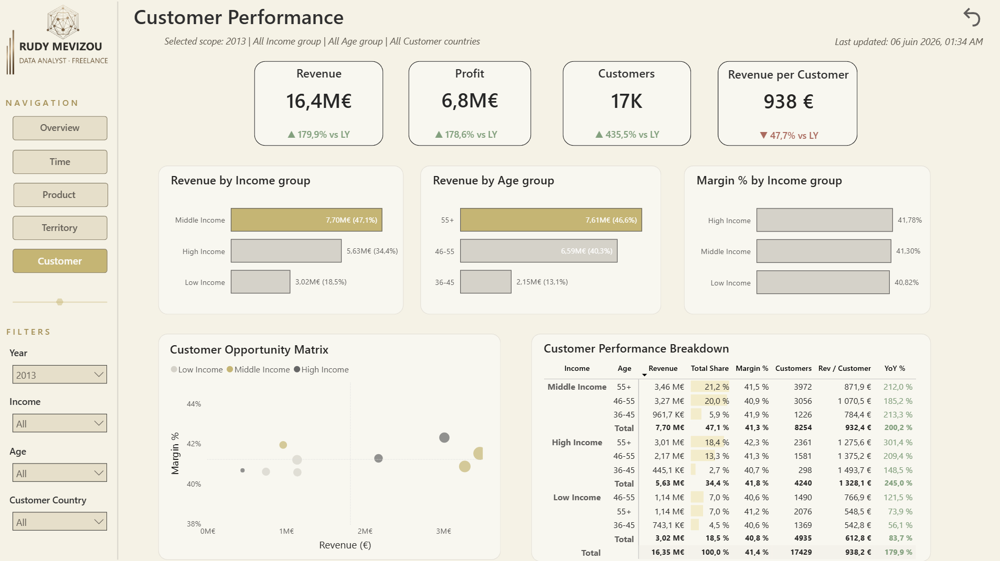
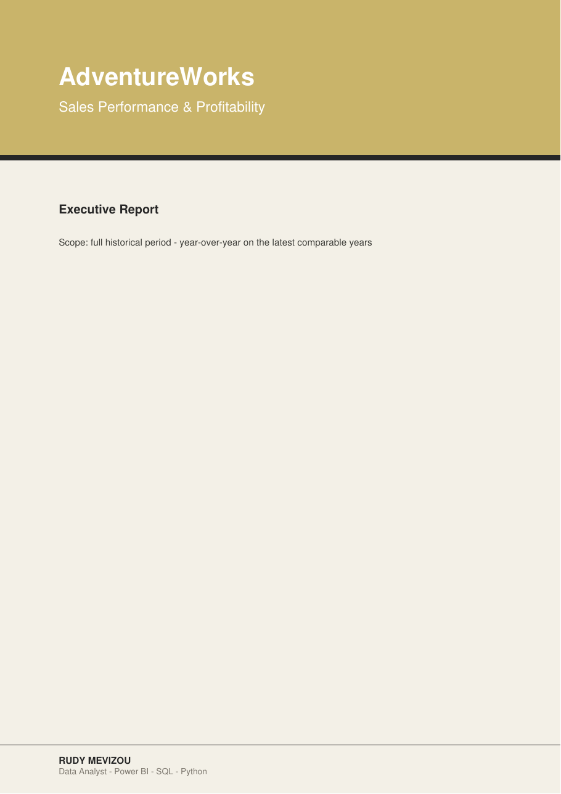
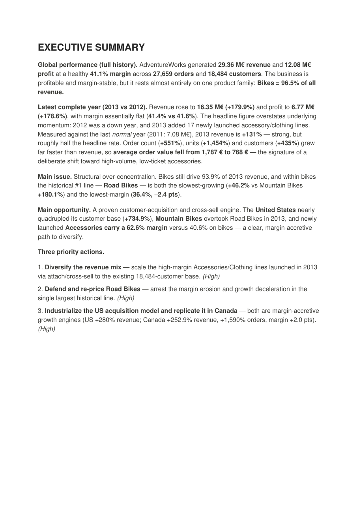

# AdventureWorks — Sales Performance & Profitability (BI + AI)

**End-to-end analytics project:** SQL Server → Power BI → Python → AI-generated executive report.
From raw sales data to an interactive dashboard **and** a decision-ready PDF report.

`SQL Server` · `Power BI` · `DAX` · `Power Query (M)` · `Python (pandas)` · `AI reporting` · `reportlab`


> *Dashboard preview — Overview page. (Swap in a dedicated `screenshots/dashboard_preview.png` for a wider banner if you have one.)*

---

## 🎯 Business problem

AdventureWorks operates across multiple countries, product categories, and customer segments. Without a centralized reporting solution, decision-makers must manually consolidate data from several sources, making it hard to identify performance drivers and act in time.

Management needs a clear understanding of:

- Which **products** drive revenue and profitability.
- Which **customer segments** generate the highest value.
- Which **regions** are growing or declining.
- Where **commercial efforts** should be prioritized.
- Which areas present **risks or growth opportunities**.

> **Business question:** *How can AdventureWorks identify revenue drivers, profitability risks, and growth opportunities — from a single source of truth?*

The objective of this project is to transform raw sales data into actionable business insights through a complete analytics workflow combining **SQL, Power BI, Python automation, and AI-generated executive reporting**.

---

## TL;DR

A complete BI pipeline built on the Microsoft **AdventureWorks** sales data:

1. **SQL** — analytical views in a dedicated `bi` schema + a data-quality suite.
2. **Power BI** — a clean star schema, **130 DAX measures**, and a 5-page interactive dashboard.
3. **Python + AI** — a reusable pipeline that computes the KPIs, builds charts, prompts an LLM, and assembles a **branded executive PDF report** — with built-in analytical guardrails.

> **Who it's for.** The final deliverable is designed for a **sales manager** who needs fast visibility on revenue, margin, risks and actionable opportunities — without digging through spreadsheets.

> **Business framing.** AdventureWorks wants to understand *where* revenue and margin come from, *how* performance evolves, and *what* to do next. This project answers all three.

---

## 🏗️ Architecture

```
SQL Server (AdventureWorksDW)
   │  bi.* analytical views  +  data-quality checks
   ▼
Power BI  ──  star schema (Sales fact · Date / Product / Customer / Territory)
   │          130 DAX measures · time intelligence · dynamic titles
   ├─►  Interactive dashboard (5 pages)
   │
   ▼
Python pipeline
   ├─ generate_ai_context.py  → computes KPIs (sum + nunique) → prompt + charts
   ├─ [LLM writes the narrative] → ai_report.md
   └─ report_builder.py  → branded PDF (narrative + charts)
   ▼
Executive Report (PDF)
```

---

## 🧩 Data model

A classic **star schema**, optimized for slicing and time intelligence:

| Table | Type | Role |
|---|---|---|
| **FactSales** | Fact | Order-line grain — revenue, cost, profit, quantity |
| **DimDate** | Dimension | Calendar + time intelligence (YoY, YTD) |
| **DimProduct** | Dimension | Category / subcategory / product |
| **DimCustomer** | Dimension | Demographics & segments (age bands) |
| **DimTerritory** | Dimension | Country / region / group |

*One fact table surrounded by conformed dimensions keeps measures simple, relationships unambiguous, and time intelligence reliable.*



---

## 📊 Power BI dashboard

A 5-page interactive report (Overview · Trends & Seasonality · Product · Territory · Customer) with a custom theme, dynamic KPI cards, opportunity matrices and slicers.

| Overview | Trends & Seasonality |
|---|---|
|  |  |

| Product | Territory | Customer |
|---|---|---|
|  |  |  |

📂 Open the dashboard: [`02_powerbi/AdventureWorks_Sales_Dashboard.pbix`](02_powerbi/AdventureWorks_Sales_Dashboard.pbix)

---

## 📄 AI-generated executive report

The Python pipeline turns the same data into a **branded, decision-ready PDF** — an executive summary, detailed analysis, prioritized recommendations, and an appendix of auto-generated charts. The narrative is written by an LLM **from the computed figures** (no invented numbers), framed by analytical guardrails.

> **The LLM does not calculate KPIs.** It only generates the narrative from Python-computed outputs — every number in the report comes from the pipeline, not the model.

| Cover | Executive summary |
|---|---|
|  |  |

📄 Read the full report: [`04_report/AdventureWorks_Executive_Report.pdf`](04_report/AdventureWorks_Executive_Report.pdf)

---

## 🔑 Key insights

- **Product concentration risk** — Bikes generate **96.5% of revenue** at 40.6% margin, while **Accessories carry a 62.6% margin** on just 2.4% of revenue: a clear, margin-accretive cross-sell opportunity.
- **Geographic concentration** — the **US and Australia together account for ~63%** of revenue; margins are uniform (~41%), so growth — not pricing — is the lever.
- **Customer concentration** — buyers **aged 46+ drive ~85% of revenue**, with no material under-36 segment.
- **Trajectory (read honestly)** — the **+180% jump in 2013 is a rebound** from a depressed 2012, amplified by new product launches — **not** organic tripling (≈ +131% vs the last normal year, 2011).

*All-time: €29.36M revenue · €12.08M profit · 41.1% margin · 27,659 orders · 18,484 customers.*

---

## ⭐ What makes this pipeline solid

- **Correct distinct counts** — Orders/Customers use `COUNT(DISTINCT …)` / `nunique`, never summed across segments (a classic trap that inflates counts ~2.7×).
- **Honest time intelligence** — year-over-year is computed **only on fully comparable years**; partial years are excluded automatically.
- **Dynamic rebound guardrail** — the pipeline detects whether the prior year was a dip and frames the YoY accordingly (rebound vs organic), instead of hard-coding an assumption.
- **"New in {year}" handling** — segments with a negligible prior-year base are reported as **launches**, not as misleading growth percentages.
- **Insight-driven charts** — titles state the conclusion; an **Opportunity Matrix** (revenue × margin) highlights where to act.
- **Reusable by design** — change a small settings block (client, dimensions, palette, `full`/`executive` mode) and the pipeline runs on any sales dataset.

---

## 🧠 What I learned / Challenges

- **Handling non-comparable years** — early and partial years distort year-over-year reads. I built logic to compare only fully comparable years and to distinguish a *rebound* from *organic* growth, rather than reporting a misleading +180%.
- **Avoiding inflated distinct counts** — summing distinct customers or orders across segments overcounts by ~2.7×. Enforcing `COUNT(DISTINCT …)` / `nunique` end-to-end was essential for trustworthy KPIs.
- **Separating BI calculations from AI narrative** — KPIs are computed in SQL and Python; the LLM only writes the story from those validated numbers. Keeping the math and the narrative in separate layers makes the output both reproducible and safe to share.

---

## 📁 Repository structure

```
adventureworks-sales-dashboard/
├── README.md
├── requirements.txt
├── .gitignore
├── 01_sql/
│   ├── views/            # bi schema + analytical views
│   ├── data_quality/     # data-quality checks
│   ├── validation/       # business validation queries
│   └── ai_pipeline/      # fine-grain view + export for the AI report
├── 02_powerbi/
│   └── AdventureWorks_Sales_Dashboard.pbix
├── 03_python/
│   ├── generate_ai_context.py   # compute → prompt + charts
│   └── report_builder.py        # narrative + charts → PDF
├── 04_report/
│   ├── AdventureWorks_Executive_Report.pdf
│   └── ai_report.md
└── screenshots/
```

---

## ▶️ Reproduce the AI report pipeline

```bash
pip install -r requirements.txt
```

1. Restore **AdventureWorksDW** in SQL Server and run the scripts in `01_sql/` (views → quality → ai_pipeline). Export the fine-grain view to `ai_sales_raw.csv`.
2. `python 03_python/generate_ai_context.py` → produces the prompt + the charts.
3. Paste the prompt into an LLM (Claude / ChatGPT) and save the answer as `ai_report.md`.
4. `python 03_python/report_builder.py` → builds the PDF.

> Switch `REPORT_MODE` between `"full"` and `"executive"` in `generate_ai_context.py` to produce either a complete analysis or a tight executive brief.

---

## 🧰 Tech stack

**SQL Server** · **Power BI / DAX / Power Query** · **Python** (pandas, matplotlib, reportlab) · **LLM-assisted reporting**

*Data: Microsoft AdventureWorksDW sample database. Built for portfolio purposes; the report narrative is AI-assisted and grounded strictly in the computed figures.*

---

## 👤 Author

**Rudy Mevizou** — Freelance Data Analyst (Power BI · SQL · Python)
PhD in Biology · Data Scientist training (DataScientest)

📧 rudy.mevizou.data@outlook.com · 🔗 [LinkedIn](https://www.linkedin.com/in/your-handle) · [Malt](https://www.malt.fr/profile/your-handle)
